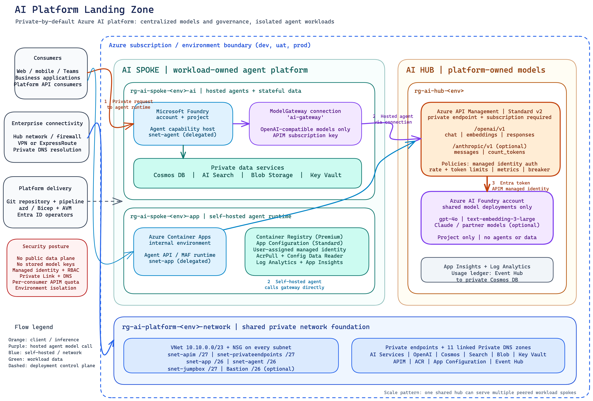

# AI Platform Landing Zone

Bicep templates for a private AI landing zone on Azure. Clone it, set two parameters, deploy.

> This is a community sample, not a Microsoft product and not an official Microsoft repository.

You get an Azure AI Foundry workload with its data services, a Container Apps runtime for your own
agent containers, and optionally an API Management gateway in front of your models. Everything runs
on a private network with no public data-plane access.



The diagram source is [docs/arch.excalidraw](docs/arch.excalidraw), editable at
[excalidraw.com](https://excalidraw.com); [docs/architecture.svg](docs/architecture.svg) is the
vector export. For the reasoning behind the layout, see [docs/architecture.md](docs/architecture.md).

## What you can run on it

The landing zone supports two ways of running agents, and you can use either or both.

If you want Foundry to host your agents, the Agent Service is set up for you: the Foundry account
and project are created with a capability host injected into a dedicated subnet. Nothing else to do.

If you'd rather build and run your own agent container (Microsoft Agent Framework, LangGraph, a
plain FastAPI app, whatever), the app layer gives you an internal Container Apps environment, a
private container registry, App Configuration, and a managed identity that can pull images and read
config without any secrets.

Models are deliberately *not* deployed into the workload. They come from the gateway, so quotas,
cost tracking, and multi-vendor routing stay in one place instead of being scattered across
projects.

## Before you start

- An Azure subscription where you have Owner or Contributor + User Access Administrator
- [Azure CLI](https://learn.microsoft.com/cli/azure/install-azure-cli) 2.60 or newer
- [Azure Developer CLI](https://learn.microsoft.com/azure/developer/azure-developer-cli/install-azd)
  if you want to use `azd`
- A region with Azure AI Foundry capacity. Sweden Central and East US 2 are safe choices.

The templates register no preview features. Application Insights creates a smart-detection alert
rule, so the `Microsoft.AlertsManagement` provider has to be registered on the subscription. Most
subscriptions already have it; if the deployment fails with `MissingSubscriptionRegistration`, run:

```bash
az provider register --namespace Microsoft.AlertsManagement
```

## Deploy

With `azd`:

```bash
azd auth login
azd env new dev
azd up
```

With the Azure CLI:

```bash
az login
az account set --subscription <your-subscription-id>

az deployment sub create \
  --location swedencentral \
  --template-file infra/main.bicep \
  --parameters environments/dev.bicepparam
```

The first deployment takes about 15 to 25 minutes. Most of that is the Foundry capability host and
the private endpoints.

To deploy another environment, copy `environments/dev.bicepparam`, change `environmentName`, and
point the deployment at the new file. Names are derived from the environment name and a hash of the
subscription ID, so several environments can live side by side without collisions.

## Parameters

| Name | Default | What it does |
| --- | --- | --- |
| `environmentName` | required | Short name such as `dev`, `uat`, `prod`. Used in resource names. |
| `location` | deployment location | Azure region for everything. |
| `deploySpoke` | `true` | The agent workload and its data services. Set to `false` to deploy only the hub. |
| `deployHub` | `true` | The gateway and the Foundry account holding the models. Set to `false` to deploy only a spoke. |
| `deployAppLayer` | `true` | Container Apps runtime for self-hosted agents. Set to `false` if you only want Foundry hosted agents. |
| `modelDeployments` | `gpt-4o` and `text-embedding-3-large` | Models created on the hub Foundry account and fronted by the gateway. |
| `deployAnthropicApi` | `false` | Adds a second gateway API for Claude, which uses the Anthropic Messages schema. |
| `deployUsageLedger` | `true` | Streams a usage record per gateway call to an Event Hub, and creates the Cosmos DB container that holds the ledger. |
| `deployJumpbox` | `false` | Azure Bastion and a Linux jumpbox. Requires `jumpboxAdminPassword`. |
| `jumpboxAdminPassword` | empty | Password for the jumpbox admin account. Pass it on the command line; do not put it in a parameter file. |
| `enableJwtValidation` | `false` | Rejects gateway calls that do not carry a valid Entra ID token. |
| `callsPerMinute` | `300` | Request budget per gateway subscription key. |
| `apimPublisherEmail` | `admin@example.com` | Publisher email on the API Management instance. Change this. |
| `apimPublisherName` | `AI Platform` | Publisher name on the API Management instance. |
| `tags` | `{}` | Extra tags applied to every resource. |

Everything deploys by default except the jumpbox, which creates a VM you have to pay for and give a
password to. The `deploySpoke` and `deployHub` switches exist so a platform team
can run a shared hub in one subscription while product teams deploy their own spokes elsewhere.

To deploy with the jumpbox, pass the password separately:

```bash
az deployment sub create \
  --name ai-platform-dev \
  --location swedencentral \
  --template-file infra/main.bicep \
  --parameters environments/dev.bicepparam \
  --parameters jumpboxAdminPassword="$JUMPBOX_PASSWORD"
```

## What gets created

Four resource groups.

**`rg-ai-platform-<env>-network`**

A `/23` virtual network split into six subnets, an NSG, and the private DNS zones that the private
endpoints resolve against.

| Subnet | Size | Used by |
| --- | --- | --- |
| `snet-apim` | /27 | API Management outbound VNet integration, delegated to `Microsoft.Web/serverFarms` |
| `snet-privateendpoints` | /27 | Every private endpoint |
| `snet-app` | /26 | Container Apps environment |
| `snet-agent` | /26 | Foundry agent service |
| `snet-jumpbox` | /27 | Jumpbox VM, only when `deployJumpbox` is on |
| `AzureBastionSubnet` | /26 | Azure Bastion, only when `deployJumpbox` is on |

Azure requires the Bastion subnet to carry that exact name, and it rejects any NSG that does not
include the full Bastion rule set, so it is the one subnet left without one.

**`rg-ai-spoke-<env>-ai`**

Foundry account and project with the agent capability host, plus Cosmos DB, AI Search, Storage, and
Key Vault, all behind private endpoints. This Foundry has no model deployments; it runs agents.

Foundry and its data services share a resource group because the Azure Verified Module that creates
them provisions them together as a single unit.

**`rg-ai-spoke-<env>-app`**

Container Apps environment, container registry, App Configuration, the agent's managed identity, Log
Analytics, and Application Insights. Separate from the `-ai` group so that redeploying application
compute never touches stateful data.

**`rg-ai-hub-<env>`**

API Management on Standard v2 with a private endpoint for inbound traffic, its own Log Analytics
workspace and Application Insights, and a Foundry account holding the model deployments. That
Foundry runs no agents and has no data services of its own.

When `deployUsageLedger` is on, this group also gets an Event Hub that receives one usage record per
gateway call and a Cosmos DB container sized to hold them, both private and both with local
authentication disabled.

## Where models live

Models are deployed once, on the hub Foundry account, and reached through the gateway. Agents in the
spoke, whether Foundry-hosted or running in Container Apps, call API Management rather than a model
endpoint directly. Quota, cost attribution, token limits, and multi-vendor routing then live in one
place instead of being spread across projects.

The gateway exposes an OpenAI-compatible API at `/openai/v1` with chat completions, embeddings, and
responses operations. It authenticates to Foundry with its own managed identity, applies a per
subscription token limit, and emits token metrics for chargeback. No keys are stored anywhere.

Claude models do not use the OpenAI schema. They use the Anthropic Messages API, on a different path,
with a different request body and an `anthropic-version` header. Setting `deployAnthropicApi = true`
adds a second API at `/anthropic/v1` with `messages` and `count_tokens` operations, sharing the same
identity and token-limit policy.

| | OpenAI models | Claude models |
| --- | --- | --- |
| Gateway path | `/openai/v1/chat/completions` | `/anthropic/v1/messages` |
| Schema | OpenAI chat completions | Anthropic Messages |
| Usable by Foundry hosted agents | yes, through the model connection | no, see below |
| Usable by self-hosted agents | yes | yes |

For Foundry hosted agents, the deployment also creates a model gateway connection on the spoke
project, so agents can select a gateway model as `ai-gateway/<model-name>`. This uses the documented
[bring your own model](https://learn.microsoft.com/azure/foundry/agents/how-to/ai-gateway)
capability, which requires an OpenAI-compatible chat completions endpoint. Claude therefore cannot be
consumed by hosted agents through this connection without a translation policy. Self-hosted agents in
Container Apps can call either API directly.

Also note that connected models do not work with the Bing grounding, SharePoint, Browser Automation,
Memory Search, or Fabric tools; an agent that needs those requires its own model deployment.

Edit `modelDeployments` in your parameter file to change which models exist. Check quota in your
region first; a deployment for a model you have no quota for will fail.

## About Standard v2 and public access

Azure requires public network access to be enabled on API Management Standard v2 when the service is
created. The private endpoint is created at the same time, but you should disable public access
afterwards so the private endpoint is the only way in:

```bash
az apim update --name <apim-name> --resource-group rg-ai-hub-dev \
  --public-network-access false
```

If you need the endpoint to be private from the moment it is created, use Premium v2 instead, which
supports internal VNet injection. Change `apimSku` in `infra/modules/ai-hub.bicep`.

## Reaching a private landing zone

There is no jump host or Bastion in these templates, and every service has public access turned off.
That means you cannot reach Foundry, the registry, or the gateway from your laptop over the
internet. You need one of:

- a peered virtual network you already connect to
- a VPN or ExpressRoute connection into the VNet
- a VM plus Azure Bastion that you add yourself

This is intentional for a landing zone that will sit behind an existing platform network. If you are
evaluating on a standalone subscription, add a Bastion host and a small VM to `snet-app` before you
try to use anything.

## Repository layout

```
infra/
  main.bicep              orchestrator, runs at subscription scope
  main.parameters.json    azd parameter bindings
  abbreviations.json      resource name prefixes
  modules/
    networking.bicep      virtual network, subnets, private DNS zones
    ai-spoke.bicep        Foundry, Cosmos DB, AI Search, Storage, Key Vault
    ai-app.bicep          Container Apps, registry, App Configuration, identity
    ai-hub.bicep          API Management, gateway API and policy, hub Foundry
    foundry-model-connection.bicep
                          connects spoke agents to gateway models
environments/
  dev.bicepparam          example parameter file
docs/
  architecture.md         how the pieces fit together
  topologies.md           subscription and resource group layout
```

All resources come from [Azure Verified Modules](https://aka.ms/avm) pinned to explicit versions.

## Cost

Nothing here is free, but the spoke alone is modest. Container Apps scales to zero when idle, Cosmos
DB and Storage cost cents at rest, and AI Search on the standard tier is the largest line item.
Premium container registry is required for private endpoints and has a fixed monthly cost.

The hub is the expensive part. API Management Standard v2 runs continuously and is billed per hour
whether or not it serves traffic. If you are only experimenting with the agent workload, deploy with
`deployHub = false` and add it later.

Model deployments are billed per token consumed, so an idle landing zone costs nothing for
inference. They do consume quota in the region, which is worth checking before you deploy.

## How this compares to the official Microsoft accelerators

This repository is an unofficial sample. Microsoft ships two supported accelerators that it
maintains: an
[AI Foundry landing zone](https://github.com/Azure/bicep-ptn-aiml-landing-zone) and an
[API Management AI gateway](https://github.com/Azure-Samples/ai-hub-gateway-solution-accelerator).
If you want something backed by Microsoft, start with those.


Treat this repo as a starting point to copy and modify, not as a dependency to track.

## Contributing

Issues and pull requests are welcome. Run `az bicep build --file infra/main.bicep` before opening a
pull request; the build should produce no warnings.

## Trademarks

Azure, Microsoft, and related names are trademarks of Microsoft Corporation. Use of them here is for
identification only and does not imply endorsement or affiliation.

## License

MIT, see [LICENSE](LICENSE). Provided as-is, without warranty of any kind.
