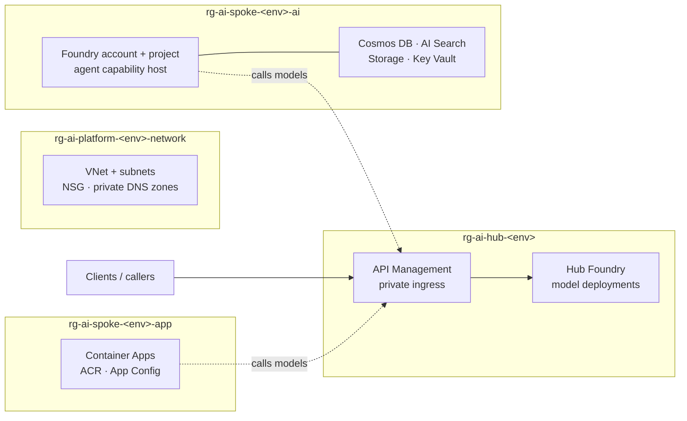

# Architecture

A deployment creates a shared network, an AI Spoke that runs agents, and an AI Hub that holds the
models and the gateway in front of them.



## Where models live

Models are deployed once, on the **hub** Foundry account, and reached through API Management. The
spoke Foundry has no model deployments. Agents in either runtime call the gateway rather than a
model endpoint directly, which keeps quota, cost attribution, and multi-vendor routing in one place.

| | Spoke Foundry | Hub Foundry |
| --- | --- | --- |
| Purpose | runs agents | hosts models |
| Model deployments | none | yes |
| Data services | Cosmos, Search, Storage, Key Vault | none |
| Agent capability host | yes | no |

### How the request flows

```
agent  ->  API Management  ->  hub Foundry model deployment
```

The gateway exposes one API per model schema, because vendors do not share a wire format:

| API | Path | Backend path | Operations |
| --- | --- | --- | --- |
| Azure OpenAI | `/openai/v1` | `/openai` | chat completions, embeddings, responses |
| Anthropic Claude (`deployAnthropicApi`) | `/anthropic/v1` | `/anthropic` | messages, count tokens |

Both share the same inbound policy:

1. Acquires a token for `https://cognitiveservices.azure.com` using the gateway's own managed
   identity and sets it as the `Authorization` header, so no keys are stored anywhere.
2. Applies `llm-token-limit` per API Management subscription, giving each consumer its own token
   budget.
3. Emits token metrics with `llm-emit-token-metric`, dimensioned by subscription and API, for cost
   attribution.

The gateway's managed identity is granted **Cognitive Services OpenAI User** on the hub Foundry
account, plus **Cognitive Services User** when the Anthropic API is enabled, because the Anthropic
data plane sits outside the OpenAI role's scope.

Note that the token limit and metric policies count Anthropic responses correctly on the v2 tiers.
On Premium classic they deploy but do not count Claude tokens reliably, so budget enforcement there
needs an external counter fed by `log-to-eventhub`.

### Connecting hosted agents to gateway models

Foundry hosted agents reach the gateway through a **model gateway connection** on the spoke project,
created by `foundry-model-connection.bicep`. This is the documented
[bring your own model](https://learn.microsoft.com/azure/foundry/agents/how-to/ai-gateway) capability;
see also [connected models](https://learn.microsoft.com/azure/foundry/agents/how-to/connected-models).

The connection is of category `ModelGateway`, targets the gateway base URL, and authenticates with an
API Management subscription key read at deployment time. Agents then reference a model as
`ai-gateway/<model-name>`.

Two limitations to know about:

- Capability hosts are not the mechanism for reaching models in another resource. The capability
  host in the spoke exists for the agent service's own data stores; model access is the connection.
- Connected models do not support the Browser Automation, Bing grounding, SharePoint, Memory Search,
  or Microsoft Fabric tools. An agent needing those requires a model deployment on its own project.

The connection requires an OpenAI-compatible chat completions endpoint, so it points at the
`/openai/v1` API. Claude, on the Anthropic Messages schema, cannot be consumed by hosted agents
through this connection without a translation policy in the gateway.

Self-hosted agents in Container Apps have no such constraints; they call either gateway API directly.

## Shared network (`rg-ai-platform-<env>-network`)

A `/23` virtual network, an NSG applied to every subnet, and the private DNS zones that all private
endpoints resolve against.

| Subnet | Size | Used by |
| --- | --- | --- |
| `snet-apim` | /27 | API Management outbound VNet integration, delegated to `Microsoft.Web/serverFarms` |
| `snet-privateendpoints` | /27 | Every private endpoint |
| `snet-app` | /26 | Container Apps environment |
| `snet-agent` | /26 | Foundry agent service |
| `snet-jumpbox` | /27 | Jumpbox VM, when `deployJumpbox` is on |
| `AzureBastionSubnet` | /26 | Azure Bastion, when `deployJumpbox` is on |

The Bastion subnet is the one exception to the blanket NSG. Azure requires that subnet to be named
exactly `AzureBastionSubnet`, and it rejects any NSG that does not carry the full Bastion rule set,
so no NSG is attached to it.

DNS zones: AI Services, Cognitive Services, OpenAI, Cosmos DB, AI Search, Storage blob, Key Vault,
API Management, Container Registry, App Configuration, Event Hub.

## Reaching a landing zone with no public endpoints

Every data plane in this landing zone is private, which means a laptop on the public internet cannot
reach the Foundry portal, the container registry, or the gateway. Set `deployJumpbox` to `true` and
supply `jumpboxAdminPassword` to get Azure Bastion and a small Ubuntu VM in `snet-jumpbox`. Connect
through the portal's Bastion blade; the VM has no public IP and nothing is exposed to the internet.

This is a convenience for evaluating the landing zone. Production environments usually replace it
with ExpressRoute or a site-to-site VPN into a hub network.

Bastion Standard needs a public IP of its own. Some governed subscriptions block public IP creation
outright, and there the deployment fails with `SubscriptionNotRegisteredForFeature` on
`Microsoft.Network/AllowBringYourOwnPublicIpAddress`. Leave `deployJumpbox` off in those
subscriptions and reach the network over ExpressRoute or a VPN instead.

## AI Spoke

### `rg-ai-spoke-<env>-ai` — agents and their data

Created by the `ptn/ai-ml/ai-foundry` Azure Verified Module: a Foundry account and project with the
agent capability host injected into `snet-agent`, plus Cosmos DB, AI Search, Storage, and Key Vault,
each behind a private endpoint. This is the Foundry Agent Service, the hosted agent runtime.

Foundry and its data services share a resource group because that module provisions them as a single
unit.

### `rg-ai-spoke-<env>-app` — self-hosted agent runtime

Present when `deployAppLayer` is `true`:

- Container Apps managed environment, VNet-injected into `snet-app` and internal only
- Container Registry, Premium tier, public access disabled, private endpoint
- App Configuration, local auth disabled, private endpoint
- A user-assigned managed identity with `AcrPull` and `App Configuration Data Reader`
- Log Analytics and Application Insights

Kept separate from the `-ai` group so redeploying application compute never touches stateful data.

## AI Hub (`rg-ai-hub-<env>`)

- API Management on Standard v2 with a private endpoint for inbound traffic, plus Log Analytics and
  Application Insights wired in as a logger
- A Foundry account holding the shared model deployments, with a private endpoint and no data
  services

Standard v2 supports the native LLM token limit and metric policies, which is what makes per-team
quota and cost attribution possible at the gateway. Premium v2 supports internal VNet injection if
you need the endpoint private from the moment it is created; Premium classic adds self-hosted
gateways. Change `apimSku` in `infra/modules/ai-hub.bicep`.

### Why the gateway needs both inbound and outbound networking

The private endpoint on API Management covers **inbound** traffic only. Without outbound virtual
network integration the gateway calls the Foundry backend from public IP addresses, and the backend
rejects it with `403 Public access is disabled`, because its own public access is turned off.

The gateway is therefore configured with both:

- a private endpoint in `snet-privateendpoints` for inbound requests
- outbound virtual network integration into `snet-apim`, which must be a dedicated subnet of at
  least /27, carry an NSG, and be delegated to `Microsoft.Web/serverFarms`

Outbound integration is supported on Standard v2 and Premium v2. See
[Integrate an API Management instance with a virtual network for outbound connections](https://learn.microsoft.com/azure/api-management/integrate-vnet-outbound).

### What the gateway policy does

Every API on the gateway shares one policy, applied in this order:

1. Optional Entra ID token validation (`enableJwtValidation`). Off by default so the landing zone
   can be tested with a subscription key alone; turn it on once you have an app registration to
   validate against.
2. A request budget per subscription key (`callsPerMinute`), which stops one caller from starving
   the others.
3. Managed identity authentication to the Foundry backend, so no model keys exist anywhere.
4. A token budget per subscription key (`tokensPerMinute`) and a token metric emitted to
   Application Insights, dimensioned by subscription and API.
5. Backend selection.

Each backend also carries a circuit breaker. After `circuitBreakerFailureCount` failures inside a
minute, counting 429s and 5xx responses, the gateway stops sending traffic to that backend for a
minute rather than queueing calls behind a service that is already struggling. It honours
`Retry-After` when the backend sends one.

### Usage ledger

Application Insights metrics are sampled and retained on a schedule that suits monitoring, not
billing. When `deployUsageLedger` is on, the gateway also writes one JSON record per call to an
Event Hub: timestamp, subscription key, API, operation, response code, and latency.

The deployment creates the Event Hub and a Cosmos DB container (`ai-usage` / `token-events`,
partitioned on `/subscriptionId`, with a 90 day TTL) ready to receive those records, both private and
both with local auth disabled. The gateway's managed identity gets `Azure Event Hubs Data Sender`.

The consumer that moves records from the Event Hub into Cosmos DB is deliberately not included.
Chargeback rules differ too much between organisations to be worth guessing at, and the hop is a few
lines in an Azure Function, a Logic App, or a Container Apps job. This repo gives you both ends of
the pipe and the identity that connects them.

To confirm events are flowing, read the `IncomingMessages` metric on the Event Hub namespace. Allow
a few minutes before trusting a zero: the gateway logger is buffered and the metric itself lags, so
a query run immediately after a request will report nothing even when the pipe is healthy.

```bash
az monitor metrics list \
  --resource "$(az eventhubs namespace show -g <rg> -n <namespace> --query id -o tsv)" \
  --metric IncomingMessages --aggregation Total --interval PT1M \
  --start-time "$(date -u -v-20M +%Y-%m-%dT%H:%M:%SZ)"
```

## Deploying part of the landing zone

Both pillars deploy by default. `deploySpoke` and `deployHub` let you deploy one on its own, for
example a shared hub in a platform subscription with spokes deployed separately per team. The
network is always created because both pillars depend on it.
